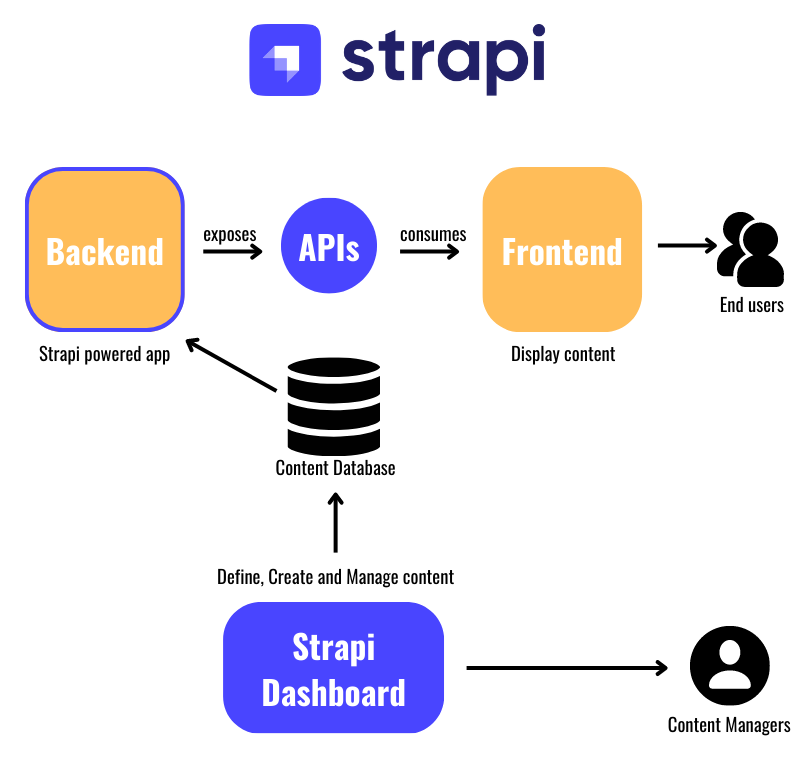
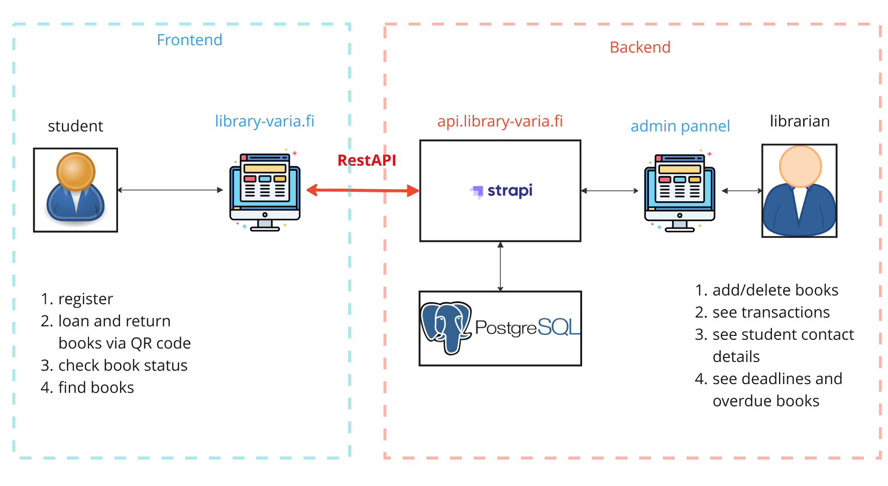
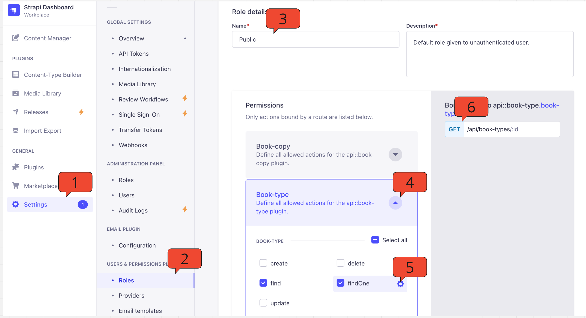
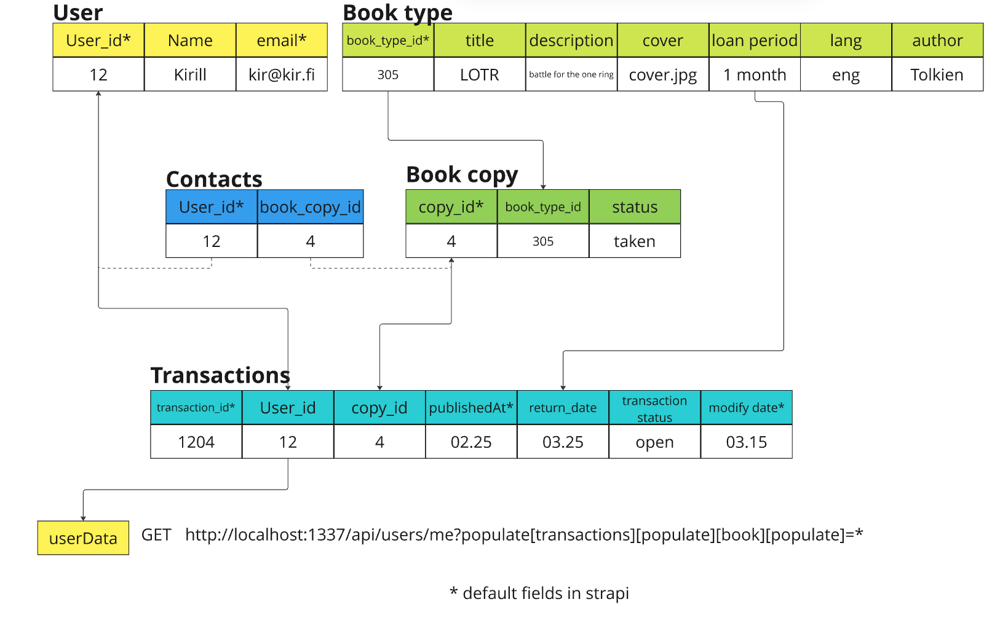

## BACKEND FOR LIBRARY PROJECT

<a name="readme-top"></a>

<div align="center">
  
  
  
  
</div>


## A step-by-step guide about why we chose it and how to operate it 
<!-- <details> -->
  <!-- <summary>Содержание</summary> -->
  <ol>
    <li><a href="#prepare">Concept</a></li>
    <li><a href="#docker-launch">Запуск докера</a></li>
    <li><a href="#import-db">Импорт дампа бд в MySQL контейнер</a></li>
    <li><a href="#launch-wp">Запуск WP</a></li>
    <li><a href="#finish">Завершение разработки</a></li>
  </ol>
<!-- </details> -->

## Concept
<a name="concept"></a>

Strapi is a powerfull tool, that helps to provide API from database in an easiest way, making a lot of opportunity to operate with data.
Based on headless concept strapi connects database to ANY front-end via its API from the box.
The closest analog was Django or FastAPI. I chose Strapi since I worked with it on my workplace a lot.


It also provides a nice and flexible admin pannel from the box, so we didn't have to build it ourselves.

Зачем нужна эта страпи в библиотеке? 
в ней по сути настроены все роуты для HTTP запросов



в то же врем у страпи есть большое поле для костомизации, например, если нам нужен новый роут с новым поведением - мы просто дополняем код страпи необходимым кодом и все. главная особенность - нам нужно учитывать синтаксис, иногда это может быть сложнее, чем кажется.

Поговорим об этом конкретном страпи:
не вдаваясь в глубокие подробности можно сказать, что страпи отдает данные согласно политике доступа, и если у пользователя нет прав доступа к данным - появится ошибка 403.

Доступ к каждой коллекции регулируется в настройках - роли - роль пользователя. Внизу есть список коллекций, в каждом из которых можно найти настройки доступа.



На схеме видно, что у публичного (3) пользователя есть доступ к коллекции тип книги (4) найти 1 (5) и найти несколько, доступ к этим данным осуществляется по эндпоинту (6)

Узнать какой доступ у разных груп пользователей есть к ккаким коллекциям можно прокликав у каждой группы (2) - public, authorized, librarian доступ к разным коллекциям. таким образом можно понять какие запросы должны возвращать данные, а какие нет.

## Схема базы данных:


 
1. Таблица юзеров содержит в себе информацию о всех пользователях

2. Коллекция "тип книги" - база информации о книгах, название, автор и описание к ней доступ рид онли. У типа книги нет реального воплощения на полке библиотеки

3. Коллекция "копия книги" - список реальных экземпляров одного и того же типа книги, например, есть книга властелина колец, и на полке стоит 2 экземпляра. В коллекции "копия книги" будет 2 записи об этих экземплярах, которые содержат ключевую для работы всей системы информацию - `id` записи в таблице `book copy`. Итак, копия книги - это физический экземпляр типа книги.

    * Физических копий (экземпляров) у 1 типа книги может быть много.
    * У 1 копии (экземпляра) книги всегда один тип книги, потому что книга не может быть с разными названиеями, у 1 книги всегда один автор, название и содержание

4. Таблица транзакций.
Библиотека работает как онлайн магазина, поэтому в ней и есть таблица транзакций. Каждый пользователь, приходя в библиотеку и забирая оттуда книгу, - создает транзакцию со статусом `open = true`.

Когда приходит время вернуть книгу обратно на полку, пользователь закрывает открытую транзакцию, меняя статус транзакции на закрытый `open = false`. Таблица транзакций ключевая для отображения данных на фронте - мы делаем запросы через неё, получая доступ к более глубоким доступным для нас данным, но об этом позднее. Транзакциями управляют пользователи библиотеки, это их основной инструент взаимодействия с сервисом.

5. Контакты - коллекция для библиотекаря - призвана помочь ему систематизировать обращения к пользователям библиотеки: когда последний раз библиотекарь писал пользователю о необходимости возврата книги


Остальная часть данных остается для него либо недоступной для редактирования, либо скрытой


* клонировать репозиторий 
* убедиться, что `wp-cli.phar` в корневом каталоге, если нет скачать <a href="https://raw.githubusercontent.com/wp-cli/builds/gh-pages/phar/wp-cli.phar">отсюда</a> или <a href="https://wp-cli.org/">с сайта</a>
* при необходимости установить `PHP 5.6 or later`
* находясь в корне проекта для установки зависимостей запустить
  ```sh
  composer install
  ```
* создать файл `.env` в корне и скопировать внутрь данные из `.env.example`
* в `.env` изменить следующие значения для переменных: 
  ```env
  DB_NAME='blog'
  ```
  ```env
  DB_PASSWORD='password'
  ```
  ```env
  WP_HOME='http://localhost:8080'
  ```
* добавить 
  ```env
  DB_HOST='mysql'
  ```
* в терминале перейти в папку с темой
  ```sh
  cd web/app/themes/maximum-v3/
  ```
  и установить зависимости там 
  ```sh
  composer install
  ```
  и
  ```sh
  npm install
  ```
* раздобыть дамп базы данных для импорта в контейнер `MySQL` 
  пример такого файла `blog_localhost-2023_10_27_13_36_58-dump.sql`

* поместить дамп бд в корень проекта

  
<p align="right">(<a href="#readme-top">back to top</a>)</p>


## Запуск докера
<a name="docker-launch"></a>


* в корне проекта запустить докер контейнеры в режиме `watch` следующими командами:

  `Ubuntu`
  ```sh
  docker compose watch
  ```
  `Windows` `MacOS`
  ```sh
  docker-compose watch
  ```
* должны запуститься 4 контейнера: 
  - WP
  - MySQL
  - Redis
  - Adminer

<p align="right">(<a href="#readme-top">back to top</a>)</p>

## Импорт дампа бд в MySQL контейнер
<a name="import-db"></a>


чтобы было на что смотреть нам понадобится база данных постов, импортируем её.
* Открыть новый терминал
* Скопировать дампа базы данных, находящегося в корне проекта в контейнер MySQL:

  **!ВАЖНО** 

  предполагается, что папка проекта blog, в противном случае изменить `blog`-mysql-1:/tmp/ на свою
  ```sh
  docker cp blog_localhost-2023_10_27_13_36_58-dump.sql blog-mysql-1:/tmp/
  ```
* Входим в контейнер MySQL:
  ```sh
  docker exec -it blog-prod-mysql-1 /bin/bash
  ```
* в контейнере запускаем (с паролем `password`)
  ```sh
  mysql -u root -p
  ```
* создаём пустую базу данных blog
  ```sh
  CREATE DATABASE blog;
  ```
* выходим (бд говорит нам Bye!)
  ```sh
  exit
  ```
* импортируем бд из `/tmp/` во вновь созданную пустую бд

  **Важно!**
  На время терминал подвиснет - нужно дождаться, когда закончится импорт 1-10 минут
  ```sh
  mysql -u root -p blog < /tmp/blog_localhost-2023_10_27_13_36_58-dump.sql
  ```
* терминал можно закрыть, теперь у нас есть база данных!

<p align="right">(<a href="#readme-top">back to top</a>)</p>

## Запуск WP
<a name="launch-wp"></a>


запустим наш WP с возможностью слушать изменения, которые мы вносим.

* открыть новый терминал
* войти в контейнер WP_HOME
  ```sh
  docker exec -it blog-prod-wp-1 /bin/bash
  ```
* внутри контейнера перейти в папку темы
  ```sh
  cd web/app/themes/maximum-v3/
  ```
* запустить bud
  ```sh
  npm run dev
  ```
* сервер запустится на `localhost:3000` и `127.0.0.1:8080`
* теперь внесенные изменения в коде будут отображаться в браузере.

  **Важно!**
  если делать отправку комментариев к постам с localhost:3000 - в консоли ошибка cors, для её решения можно перейти на 127.0.0.1:8080 и отправлять оттуда

<p align="right">(<a href="#readme-top">back to top</a>)</p>

## Завершение разработки
<a name="finish"></a>

после внесенных изменений

* в терминале с запущенным bud нажать `CTRL+C`
* остановить докер
  ```sh
  docker compose down
  ```
  `Windows` `MacOS`
  ```sh
  docker-compose down
  ```

<p align="right">(<a href="#readme-top">back to top</a>)</p>